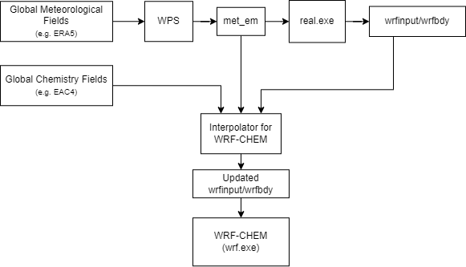

# Interpolator for WRF-CHEM

Interpolator for [WRF-CHEM](https://github.com/wrf-model/wrf) is a preprocessing application for using global chemistry model fields with WRF-CHEM. It interpolates the global chemistry model fields to the WRF-CHEM grid and vertical levels. Think of it like WPS but for chemistry fields.

Some features:

- Interpolates 3D fields
- Can do species/size bin mapping through linear combinations of source fields
- Potentially support many global models (currently supports CAMS EAC4)

The application is written in Python and is meant to be used a command-line tool. Some potential limitations:

- The application currently assumes that fields are mixing ratios.
- The global model fields should be on a regular lat-lon grid.
- No nesting support
-

## Installation

The application is available on PyPI and can be installed using pip:

```bash
pip install interpolator-for-wrfchem
```

## Usage

The workflow for using the interpolator is as follows:

1. Use WPS and `real.exe` as usual to generate the `met_em`, `wrfinput`, and `wrfbdy` files.
2. Download global chemistry model fields (e.g. CAMS EAC4) for the same time period as the WRF simulation.
3. Run the interpolator to interpolate the global chemistry model fields to the WRF-CHEM grid and vertical levels.
4. Run WRF-CHEM.

The interpolator will update `wrfinput` and `wrfbdy` files to include the chemistry information.



The interpolator is a command-line tool and can be run as follows:

```bash
interpolator-for-wrfchem <global model data path> <met_em path> <wrfinput_d01 path> <wrfbdy_d01 path> <species map path> <output path>
```

The `wrfinput_d01` and `wrfbdy_d01` files **WILL BE MODIFIED**!

There are some optional flags:

- `--copy-icbc`: Make a backup of the `wrfinput` and `wrfbdy` files before updating them.
- `--no-ic` and `--no-bc`: Do not update the `wrfinput` and `wrfbdy` files, respectively.
- `--diagnostics`: Store some diagnostic information in the `diag.nc` file.

## Species mapping

In many cases, the available fields of the global model do not directly correspond to the ones used by the chemistry/dust scheme you want to use in WRF-CHEM. For example, you might have dust concentrations available in different size bins. The application supports "species mapping", through which the WRF-CHEM fields are created through a linear combination of global model fields, after interpolation.

Detailed description of the species file format is available in [species_maps.md](./species_maps/species_maps.md).

## License

The interpolator is licensed under the MIT License. See [LICENSE](./LICENSE) for more information.
Please cite the project if you use it for your research!
